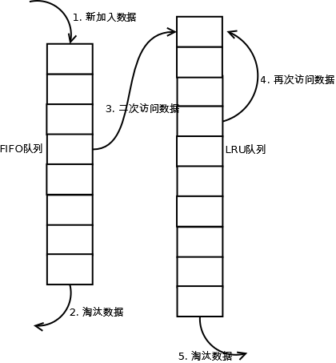

# 缓存淘汰算法

## NRU (Not Recently Used)
- 算法思想 保留最近使用过的对象
- 工作原理 
>缓存维护两个标记位，初始值为0。一个标记位R标识对象是否被使用过，另一个M用来标识对象是否被修改过。当一个对象在缓存中找到时，R置为1(referenced);当一个对象被修改时，M置为1(modified)。一个对象拥有的标记位有4种状态：  
  
>3. referenced, modified
>2. referenced, not modified
>1. not referenced, modified
>0. not referenced, not modified

- 当缓存已满，但新的对象需要加入缓存时，从等级(上面状态最左边的数字代表等级)最低的对象中随机淘汰一个。  
- 同时，缓存还有一个周期性的时钟，它在每个时间间隔会把所有对象的R标记为清零(这样就知道该对象最近，也就是一个时间间隔，是否被使用)，但M不会清零。所以上面not referenced, modified状态看似不可能，但在经历过一个时间间隔，R位被清零时将有可能发生。  
- 注意，该算法认为，最近被使用过的对象，比最近被修改过的对象更重要。

## FIFO （First-in, first-out）
- 算法思想 该算法是最简单的缓存淘汰算法，其原理正如它名字一样，最近使用过的对象放到缓存队列的末尾，队列头部保存的是最早使用的对象。

## Second-chance
- 算法思想 　这是FIFO算法的改进版，相对于FIFO算法立刻淘汰对象，该算法会检查待淘汰对象的引用标志位。如果对象被引用过，该对象引用位清零，重新插入队列尾部，像新的对象一样；如果该对象未被引用过，则将被淘汰。
- 工作原理
>在FIFO算法的基础上，
>为缓存中的所有对象增加一个“引用标志位”  
>每次对象被使用时，设置标志位为1    
>新对象加入缓存时，设置其标志位为0  
>在淘汰对象时，查看它的标志位。如果为0，则淘汰该对象；如果为1，则设置其标志位为0，重新加入队列末尾。　　 

## LRU(Least recently Used)
- 算法思想 : LRU算法的核心思想是基于“如果数据最近被访问过，它在未来也极有可能访问过”。因此如果数据的变化趋势符合这个思想，效果会比较好。

- 工作原理
> (1)数据结构：链表，用于保存需要缓存的数据；HashMap，用来读取缓存中的数据，保证时间复杂读为O(1)    
> (2)实现：  
>当数据读取时，有两种情况：  
>　a、数据在缓存中，则把该数据从新移到链表头部   
>　b、数据不在缓存中，则把数据插入到链表中。  
>　如何插入：  
>　a、如果链表不满，则把数据插入链表头部  
>　b、如果链表满了，则把尾部的数据删除，同时把其插入链表头部   

## Clock 
- 算法思想 ：　Second-chance算法是一个合理的算法，但是它并不是很高效，因为它频繁需要把对象插入到队列尾部，要知道位移也是很耗时的。而更高效的算法Clock，采用的是一个循环链表，有一个指针指向最早的对象，且每个缓存中的对象都维护一个标记位。  

- 工作原理
> 当待缓存对象在缓存中时，无论该对象标记位为0还是1，都设置为1(被使用)。同时，指针指向该对象的下一个对象。  
> 若不在缓存中时，检查指针指向对象的标记位。如果是0，则用待缓存对象替换该对象；如果是1，则置为0，指针指向下一个对象。如此直到淘汰一个对象为止。

## Gclock(Generalized clock page replacement algorithm)

- 算法思想:
    该算法是Clock的变种。相对于Clock标志位采用的是二进制0和1表示，Gclock的标志位采用的是一个整数，意味着理论上可以一直增加到无穷大。

- 工作原理

> 当待缓存对象在缓存中时，把其标记位的值加1。同时，指针指向该对象的下一个对象。  
> 若不在缓存中时，检查指针指向对象的标记位。如果是0，则用待缓存对象替换该对象；否则，把标记位的值减1，指针指向下一个对象。如此直到淘汰一个对象为止。由于标记位的值允许大于1，所以指针可能循环多遍才淘汰一个对象。

## WSclock(Working set clock page replacement algorithm)

- 算法思想
    该算法同样是clock的变种，可能是实际运用最广泛的算法。它采用clock的原理，是ws算法的增强版。算法数据结构为循环链表，每个缓存对象保存了"最近使用的时间"rt和"是否引用"的R标志位,使用一个周期计时器t。age表示为当前时间和rt的差值

- 工作原理
> 当待缓存对象存在缓存中时，更新rt为当前时间。同时，指针指向该对象的下一个对象。  
> 若不存在于缓存中时，如果缓存没满，则更新指针指向位置的rt为当前时间,R为1。同时，指针指向下一个对象。如果满了，则需要淘汰一个对象。检查指针指向的对象，  
> (1)R为1，说明对象在working set中，则重置R为0，指针指向下一个对象。  
> (2)R为0。如果age大于t，说明对象不在working set中，则替换该对象，并置R为1，rt为当前时间。如果age不大于t，则继续寻找淘汰对象。如果回到指针开始的位置，还未寻找到淘汰对象，则淘汰遇到的第一个R为0的对象。
 
## LRU-K算法 
- 算法思想  : LRU-K中的K代表最近使用的次数，因此LRU可以认为是LRU-1。LRU-K的主要目的是为了解决LRU算法“缓存污染”的问题，其核心思想是将“最近使用过1次”的判断标准扩展为“最近使用过K次”。 
- 工作原理
　　相比LRU，LRU-K需要多维护一个队列，用于记录所有缓存数据被访问的历史。只有当数据的访问次数达到K次的时候，才将数据放入缓存。当需要淘汰数据时，LRU-K会淘汰第K次访问时间距当前时间最大的数据。详细实现如下  

>(1). 数据第一次被访问，加入到访问历史列表；  
>(2). 如果数据在访问历史列表里后没有达到K次访问，则按照一定规则（FIFO，LRU）淘汰；  
>(3). 当访问历史队列中的数据访问次数达到K次后，将数据索引从历史队列删除，将数据移到缓存队列中，并缓存此数据，缓存队列重新按照时间排序；  
>(4). 缓存数据队列中被再次访问后，重新排序；  
>(5). 需要淘汰数据时，淘汰缓存队列中排在末尾的数据，即：淘汰“倒数第K次访问离现在最久”的数据。  
　　LRU-K具有LRU的优点，同时能够避免LRU的缺点，实际应用中LRU-2是综合各种因素后最优的选择，LRU-3或者更大的K值命中率会高，但适应性差，需要大量的数据访问才能将历史访问记录清除掉。

## Two queues（2Q）
- 算法思想 : 该算法类似于LRU-2，不同点在于2Q将LRU-2算法中的访问历史队列（注意这不是缓存数据的）改为一个FIFO缓存队列，即：2Q算法有两个缓存队列，一个是FIFO队列，一个是LRU队列。
-  工作原理
> 当数据第一次访问时，2Q算法将数据缓存在FIFO队列里面，当数据第二次被访问时，则将数据从FIFO队列移到LRU队列里面，两个队列各自按照自己的方法淘汰数据。详细实现如下：

>　　(1). 新访问的数据插入到FIFO队列；  
>　　(2). 如果数据在FIFO队列中一直没有被再次访问，则最终按照FIFO规则淘汰；  
>　　(3). 如果数据在FIFO队列中被再次访问，则将数据移到LRU队列头部；  
>　　(4). 如果数据在LRU队列再次被访问，则将数据移到LRU队列头部；  
>　　(5). LRU队列淘汰末尾的数据。 

## Multi Queue（MQ）
- 算法思想： 优先缓存访问次数多的数据。
- 工作原理 ： MQ算法根据访问频率将数据划分为多个队列，不同的队列具有不同的访问优先级
1. 新插入的数据放入Q0；
2. 每个队列按照LRU管理数据；
3. 当数据的访问次数达到一定次数，需要提升优先级时，将数据从当前队列删除，加入到高一级队列的头部；
4. 为了防止高优先级数据永远不被淘汰，当数据在指定的时间里访问没有被访问时，需要降低优先级，将数据从当前队列删除，加入到低一级的队列头部；
5. 需要淘汰数据时，从最低一级队列开始按照LRU淘汰；每个队列淘汰数据时，将数据从缓存中删除，将数据索引加入Q-history头部；
6. 如果数据在Q-history中被重新访问，则重新计算其优先级，移到目标队列的头部；
7. Q-history按照LRU淘汰数据的索引。

## LRU类算法对比

命中率

LRU-2 > MQ(2) > 2Q > LRU

复杂度

LRU-2 > MQ(2) > 2Q > LRU

代价

LRU-2  > MQ(2) > 2Q > LRU

实际应用中需要根据业务的需求和对数据的访问情况进行选择，并不是命中率越高越好。例如：虽然LRU看起来命中率会低一些，且存在”缓存污染“的问题，但由于其简单和代价小，实际应用中反而应用更多。

