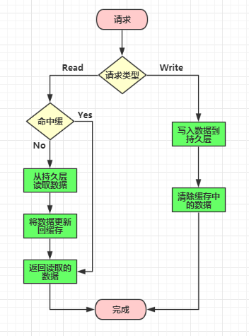
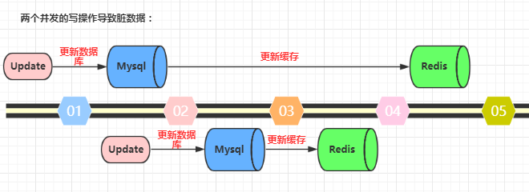
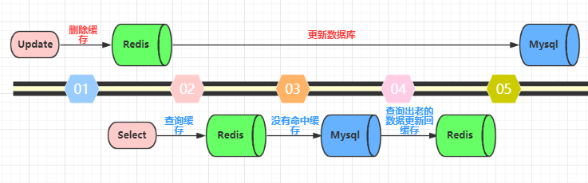
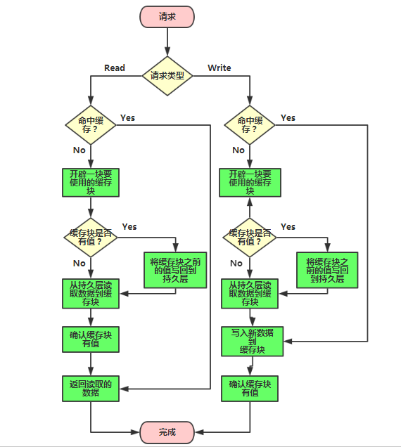

# 缓存的三种方式

## 缓存三种模式
- Cache Aside   同时更新缓存和数据库
- Read/Write Through   先更新缓存，缓存负责同步更新数据库
- Write Behind Caching 先更新缓存，缓存定时异步更新数据库

## Cache Aside 更新模式
- 失效：应用程序先从 cache 取数据，没有得到，则从数据库中取数据，成功后，放到缓存中。  
- 命中：应用程序从 cache 中取数据，取到后返回。  
- 更新：先把数据存到数据库中，成功后，再让缓存失效。
    

`先更新数据库，再更新缓存`。这种做法最大的问题就是两个并发的写操作导致脏数据。如下图（以Redis和Mysql为例），两个并发更新操作，数据库先更新的反而后更新缓存，数据库后更新的反而先更新缓存。这样就会造成数据库和缓存中的数据不一致，应用程序中读取的都是脏数据。

`先删除缓存，再更新数据库`。这个逻辑是错误的，因为两个并发的读和写操作导致脏数据。如下图（以Redis和Mysql为例）。假设更新操作先删除了缓存，此时正好有一个并发的读操作，没有命中缓存后从数据库中取出老数据并且更新回缓存，这个时候更新操作也完成了数据库更新。此时，数据库和缓存中的数据不一致，应用程序中读取的都是原来的数据（脏数据）。

`先更新数据库，再删除缓存`。这种做法其实不能算是坑，在实际的系统中也推荐使用这种方式。但是这种方式理论上还是可能存在问题。如下图（以Redis和Mysql为例），查询操作没有命中缓存，然后查询出数据库的老数据。此时有一个并发的更新操作，更新操作在读操作之后更新了数据库中的数据并且删除了缓存中的数据。然而读操作将从数据库中读取出的老数据更新回了缓存。这样就会造成数据库和缓存中的数据不一致，应用程序中读取的都是原来的数据（脏数据）。

## Read/Write Through 更新模式
在上面的 Cache Aside 更新模式中，应用代码需要维护两个数据存储，一个是缓存（Cache），一个是数据库（Repository）。而在Read/Write Through 更新模式中，应用程序只需要维护缓存，数据库的维护工作由缓存代理了。

- Read Through  
Read Through 模式就是在查询操作中更新缓存，也就是说，当缓存失效的时候，Cache Aside 模式是由调用方负责把数据加载入缓存，而 Read Through 则用缓存服务自己来加载。

- Write Through
Write Through 模式和 Read Through 相仿，不过是在更新数据时发生。当有数据更新的时候，如果没有命中缓存，直接更新数据库，然后返回。如果命中了缓存，则更新缓存，然后由缓存自己更新数据库（这是一个同步操作）

## Write Behind Caching 更新模式
Write Behind Caching 更新模式就是在更新数据的时候，只更新缓存，不更新数据库，而我们的缓存会异步地批量更新数据库。这个设计的好处就是直接操作内存速度快。因为异步，Write Behind Caching 更新模式还可以合并对同一个数据的多次操作到数据库，所以性能的提高是相当可观的。

但其带来的问题是，数据不是强一致性的，而且可能会丢失。另外，Write Behind Caching 更新模式实现逻辑比较复杂，因为它需要确认有哪些数据是被更新了的，哪些数据需要刷到持久层上。只有在缓存需要失效的时候，才会把它真正持久起来。

## 三种缓存模式的优缺点：

- Cache Aside 更新模式实现起来比较简单，但是需要维护两个数据存储，一个是缓存（Cache），一个是数据库（Repository）。

- Read/Write Through 更新模式只需要维护一个数据存储（缓存），但是实现起来要复杂一些。

- Write Behind Caching 更新模式和Read/Write Through 更新模式类似，区别是Write Behind Caching 更新模式的数据持久化操作是异步的，但是Read/Write Through 更新模式的数据持久化操作是同步的。优点是直接操作内存速度快，多次操作可以合并持久化到数据库。缺点是数据可能会丢失，例如系统断电等。

