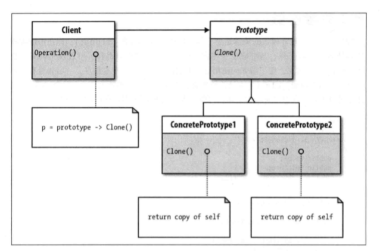

# 原型模式
- 原型模式的类图  

- 意图：用原型实例指定创建对象的种类，并且通过拷贝这些原型创建新的对象。

- 主要解决：在运行期建立和删除原型。

- 何时使用：
 > 1、当一个系统应该独立于它的产品创建，构成和表示时。   
 > 2、当要实例化的类是在运行时刻指定时，例如，通过动态装载。   
 > 3、为了避免创建一个与产品类层次平行的工厂类层次时。  
 > 4、当一个类的实例只能有几个不同状态组合中的一种时。建立相应数目的原型并克隆它们可能比每次用合适的状态手工实例化该类更方便一些。

- 如何解决：利用已有的一个原型对象，快速地生成和原型对象一样的实例。

- 优点：
 > 1、性能提高。  
 >    2、逃避构造函数的约束。

- 缺点：
 > 1、配备克隆方法需要对类的功能进行通盘考虑，这对于全新的类不是很难，但对于已有的类不一定很容易，特别当一个类引用不支持串行化的间接对象，或者引用含有循环结构的时候。  
 > 2、必须实现 Cloneable 接口。

- 使用场景： 
> 1、资源优化场景。   
> 2、类初始化需要消化非常多的资源，这个资源包括数据、硬件资源等。  
> 3、性能和安全要求的场景。  
> 4、通过 new 产生一个对象需要非常繁琐的数据准备或访问权限，则可以使用原型模式。  
> 5、一个对象多个修改者的场景。  
> 6、一个对象需要提供给其他对象访问，而且各个调用者可能都需要修改其值时，可以考虑使用原型模式拷贝多个对象供调用者使用。  
 > 7、在实际项目中，原型模式很少单独出现，一般是和工厂方法模式一起出现，通过 clone 的方法创建一个对象，然后由工厂方法提供给调用者。

- 注意事项：与通过对一个类进行实例化来构造新对象不同的是，原型模式是通过拷贝一个现有对象生成新对象的。