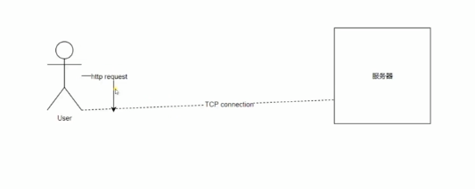
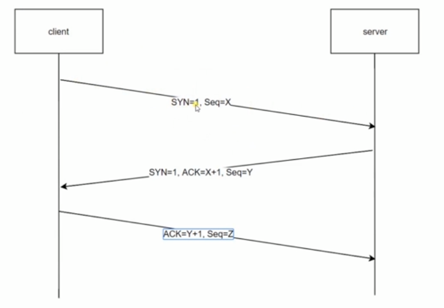

# http的三次握手
## http 请求与Tcp 连接的关系

> http不存在连接的概念，只存在请求和响应 ,发送数据包  
> TCP 通道 连接服务端，可以发送多个http 请求

## 三次握手

> 第一次握手：客户端发送syn包（syn=j）到服务器，并进入SYS_SEND状态，等待服务器确认；  
> 第二次握手：服务器收到syn包，必须确认客户的SYN(ack=j+1) 同时自己也发送一个SYN包（syn=k）,即SYN+ACK包，此时服务器进入SYN_RECV状态；  
> 第三次握手：客户端收到服务器的SYN+ACK包，向服务器发送确认包ACK(ack=k+1),此包发送完毕，客户端和服务器进入ESTABLISHED状态，完成三次握手；  
> 握手过程中传送的包里不包含数据，三次握手完毕后，客户端与服务器才正式开始传送数据。理想状态下，TCP连接一旦建立，在通信双方中的任何一方主动关闭连 接之前，TCP 连接都将被一直保持下去。断开连接时服务器和客户端均可以主动发起断开TCP连接的请求，断开过程需要经过“四次握手

