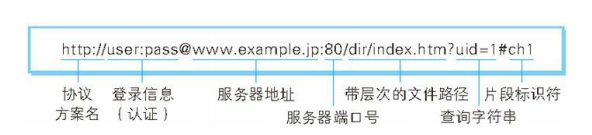

# URI 
URI 是 Uniform Resource Identifier 的缩写。URI 用字符串标识某一互联网资源 ,RFC2396 分别对这 3 个单
词进行了如下定义。
- Uniform
规定统一的格式可方便处理多种不同类型的资源，而不用根据上下文
环境来识别资源指定的访问方式。另外，加入新增的协议方案（如
http: 或 ftp:）也更容易。  

- Resource
资源的定义是“可标识的任何东西”。除了文档文件、图像或服务（例
如当天的天气预报）等能够区别于其他类型的，全都可作为资源。另
外，资源不仅可以是单一的，也可以是多数的集合体。
- Identifier
表示可标识的对象。也称为标识符。
综上所述，URI 就是由某个协议方案表示的资源的定位标识符。协议
方案是指访问资源所使用的协议类型名称。

# URL 
而 URL表示资源的地点（互联
网上所处的位置）。可见 URL是 URI 的子集。

1、使用 http: 或 https: 等协议方案名获取访问资源时要指定协议类型。不
区分字母大小写，最后附一个冒号（:）。
也可使用 data: 或 javascript: 这类指定数据或脚本程序的方案名。  
2、登录信息（认证）  
指定用户名和密码作为从服务器端获取资源时必要的登录信息（身份
认证）。此项是可选项。    
3、服务器地址  
使用绝对 URI 必须指定待访问的服务器地址。地址可以是类似
hackr.jp 这种 DNS 可解析的名称，或是 192.168.1.1 这类 IPv4 地址
名，还可以是 [0:0:0:0:0:0:0:1] 这样用方括号括起来的 IPv6   
4、服务器端口号    
指定服务器连接的网络端口号。此项也是可选项，若用户省略则自动
使用默认端口号。  
5、带层次的文件路径  
指定服务器上的文件路径来定位特指的资源。这与 UNIX 系统的文件
目录结构相似。  
6、查询字符串  
针对已指定的文件路径内的资源，可以使用查询字符串传入任意参
数。此项可选。
7、片段标识符  
使用片段标识符通常可标记出已获取资源中的子资源（文档内的某个
位置）。但在 RFC 中并没有明确规定其使用方法。该项也为可选
项。

# URN 
永久同意资源定位符  
在资源移动后还能被找到  
目前没有非常成熟的使用方案  