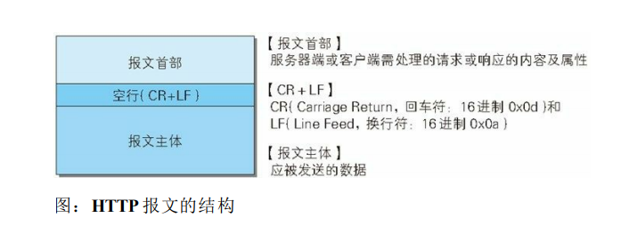

# 报文
## 1、定义
>用于http 协议交互的信息被称为HTTP报文；  
请求端（客户端）的HTTP报文叫做请求报文  
响应端（服务器端）的叫做响应报文。  
HTTP报文本身是由多行（用 CR+LF作换行符）数据构成的字符串文本。  
HTTP 报文大致可分为报文首部和报文主体两块。两者由最初出现的
空行（CR+LF）来划分。通常，并不一定要有报文主体。

## 2、请求报文及响应报文的结构
- 请求行  
包含用于请求的方法，请求 URI 和 HTTP 版本。
- 状态行   
包含表明响应结果的状态码，原因短语和 HTTP 版本。  
- 首部字段  
包含表示请求和响应的各种条件和属性的各类首部  
一般有 4 种首部，分别是：通用首部、请求首部、响应首部和实体首
部。
