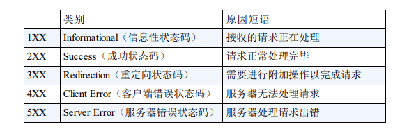

# 1、定义
HTTP 状态码负责表示客户端 HTTP 请求的返回结果、标记服务器端
的处理是否正常、通知出现的错误等工作。让我们通过本章的学习，
好好了解一下状态码的工作机制。

# 2、状态码 

## 2.1 2XX 
> 200 表示从客户端发来的请求在服务器端被正常处理了    
> 204 该状态码代表服务器接收的请求已成功处理，但在返回的响应报文中不含实体的主体部分。  
> 206 该状态码表示客户端进行了范围请求，而服务器成功执行了这部分的GET 请求。
## 3.1 3XX  重定向
> 301 永久性重定向。  
> 302 临时性重定向。该状态码表示请求的资源已被分配了新的 URI，希望
      用户（本次）能使用新的 URI 访问。  
> 303 该状态码表示由于请求对应的资源存在着另一个 URI，应使用 GET方法定向获取请求的资源。
303 状态码和 302 Found状态码有着相同的功能，但 303 状态码明确
表示客户端应当采用 GET方法获取资源，这点与 302 状态码有区
别。  
> 304 该状态码表示客户端发送附带条件的请求 2 时，服务器端允许请求访
      问资源，但未满足条件的情况。304 状态码返回时，不包含任何响应
      的主体部分。304 虽然被划分在 3XX 类别中，但是和重定向没有关
      系。

## 4.1 4XX 客户端错误
> 400 该状态码表示请求报文中存在语法错误。当错误发生时，需修改请求的内容后再次发送请求。另外，浏览器会像 200 OK 一样对待该状态码  
> 401 该状态码表示发送的请求需要有通过 HTTP 认证（BASIC 认证、
      DIGEST 认证）的认证信息。另外若之前已进行过 1 次请求，则表示
      用 户认证失败。  
> 403 该状态码表明对请求资源的访问被服务器拒绝了。
> 404 该状态码表明服务器上无法找到请求的资源。  

## 5.1 5XX 服务器错误
> 500 该状态码表明服务器端在执行请求时发生了错误。  
> 503 该状态码表明服务器暂时处于超负载或正在进行停机维护，现在无法
      处理请求  

      

      

    