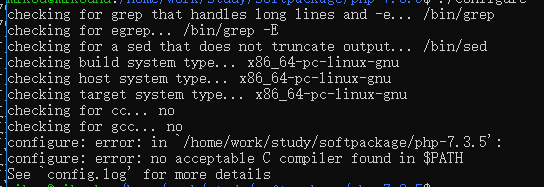

# php 源码安装

## php 源码安装
>php.net 下载最新版本 
wget https://www.php.net/distributions/php-7.3.5.tar.bz2  
>  解压文件   
>  tar -xvjf php...   
> 进入解压文件内  将php 安装在指定文件 执行 ./configure --prefix=/home/.....
> 执行./configure 要确保gcc 和 libxml2-dev 有安装 否者会出现 类似下图错误   

> 编译  make && make install   
>进入安装目录 执行./bin/php -m  查看安装的扩展  
 
> 设置php别名  vim .bash_profile(在家目录下面) 或.profile  
> 添加alias php=/home/work/study/soft/php/bin/php  
> source .bash_profile 使文件生效  
> php.ini 文件可以在安装包内copy  
> 使用 php -i|grep php.ini  将php.ini文件放在指定文件  

